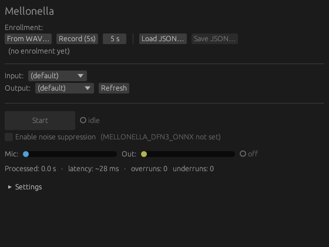
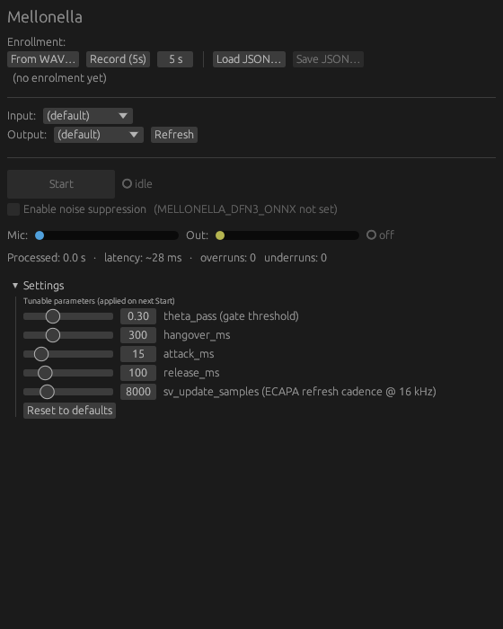

<h1>
  <picture>
    <source media="(prefers-color-scheme: dark)" srcset="assets/icon-light.svg">
    
  </picture>
  mellonella
</h1>

A real-time, single-target speaker voice filter — a hard-gating system that
suppresses noise and lets through only the frames whose voiceprint matches the
enrolled target speaker.

> **Status: Phase 1 PoC — API unstable, not production-ready.** This repository
> is the design spec plus a Python proof-of-concept. The Rust + ONNX Runtime
> port is future work.

## Name origin

Named after [*Galleria mellonella*](https://en.wikipedia.org/wiki/Galleria_mellonella)
(the greater wax moth), whose hearing reportedly extends up to ~300 kHz — the
widest auditory bandwidth currently known among terrestrial animals.

## Project goals

- **Real-time**: target algorithmic latency ≤ 100 ms.
- **No additional training**: built entirely from existing pretrained models;
  only the enrolled speaker embedding is user-specific.
- **Commercially usable**: every component ships under a permissive license
  (Apache 2.0 / MIT).
- **Desktop and mobile**: single binary on Rust + ONNX Runtime.

## Approach

Not continuous speaker separation (true target-speaker extraction) — instead a
**hard-gating** pipeline:

```
input → DFN3 (NS) → [VAD + SV + F0] decision → gate → output
```

Given that the underlying requirement is a *single* target speaker, hard
gating has these advantages:

- Minimal artifacts on the target voice (no mask-based unnaturalness, no
  spectral distortion from GAN-style generators).
- Every component is an off-the-shelf pretrained model — no additional
  training needed.
- Substantially lower compute than separation-style models; easy to deploy on
  mobile.

**Trade-off**: full separation under simultaneous speech is not possible. We
accept that with an FP-tolerant policy: if the target voiceprint component is
present in the frame, the frame passes.

## GUI

The `mellonella-gui` crate ships an egui front-end with system-tray
integration for the live filter (Linux / macOS / Windows). Screenshots
below are from the Linux build under a dark theme.

| Main window (idle) | Settings expanded |
|---|---|
|  |  |

Top to bottom: enrollment (WAV import or in-app mic record), input /
output device pickers, Start / Stop with status light, optional DFN3
noise suppression, mic / output level meters with gate indicator,
processed-seconds / latency / overrun counters, and a collapsible
Settings panel exposing the gating knobs (`theta_pass`, `hangover_ms`,
`attack_ms`, `release_ms`, `sv_update_samples`).

## Documentation

| Doc | Contents |
|---|---|
| [docs/architecture.md](docs/architecture.md) | Processing pipeline, data flow, per-stage roles |
| [docs/gating.md](docs/gating.md) | Decision logic, enrollment, online adaptation, drift mitigation |
| [docs/implementation.md](docs/implementation.md) | Tech stack, platform targets, implementation roadmap |
| [docs/decisions.md](docs/decisions.md) | Considered alternatives, rejection reasons, design decision log |
| [docs/benchmarks.md](docs/benchmarks.md) | Evaluation datasets, scenarios, minimal eval set |
| [docs/evaluation.md](docs/evaluation.md) | Evaluation protocol, pass/fail criteria, result management |
| [docs/references.md](docs/references.md) | Related work, public models, related repositories |

## Status

Phase 1 PoC is in progress. The Python implementation lives under
[`poc/`](poc/), the evaluation harness under [`bench/`](bench/), dev and
model-setup helpers under [`scripts/`](scripts/), and CI under
[`.github/workflows/ci.yml`](.github/workflows/ci.yml).

## Contributing

Bug reports, feature requests, and PRs are welcome. See
[CONTRIBUTING.md](CONTRIBUTING.md) for guidelines and
[SECURITY.md](SECURITY.md) for security disclosures.

## License

Distributed under the [Apache License 2.0](LICENSE). Bundled pretrained
components (DeepFilterNet 3, silero-vad, ECAPA-TDNN, etc.) follow their own
licenses, listed in [`docs/references.md`](docs/references.md).
